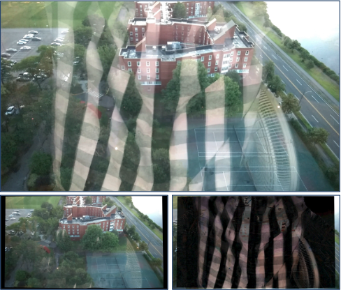
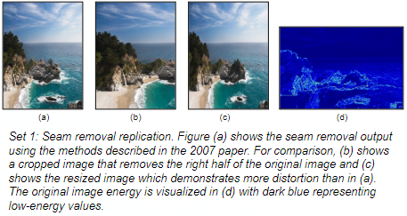
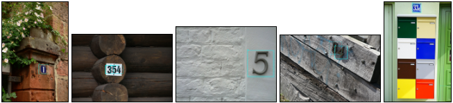

<!--
**bbooher/bbooher** is a ✨ _special_ ✨ repository because its `README.md` (this file) appears on your GitHub profile.
-->
## Hello!
My name is Ben and I'm an engineer who enjoys solving unique and challenging problems.

## See my professional experience on LinkedIn

## Languages and Tools

## My Company
I own a boutique software consulting firm, Pull Repo LLC. Click the PR logo to visit my site. You can also peruse my company's GitHub for samples and examples.

## MS Computer Science - Course Work Highlights
I've completed my M.S. in Computer Science from Georgia Tech's prestigious OMS-CS program, specializing in Computational Perception and Robotics, including AI/ML and computer vision coursework.

### Research Replication
| Summary                      | Results                                                      |
| :--------------------------- | :----------------------------------------------------------- |
| Background-Foreground Decomposition   Based on "A Computational Approach for Obstruction-Free Photography" by Xue et al 2015  | </img> |
| Minimal Seam Removal   Based on "Seam Carving for Content-Aware Image Resizing" by Avidan and Shamir 2007  | </img> |
| CNN Street Number Detection (Digit Detection) | </img> |
